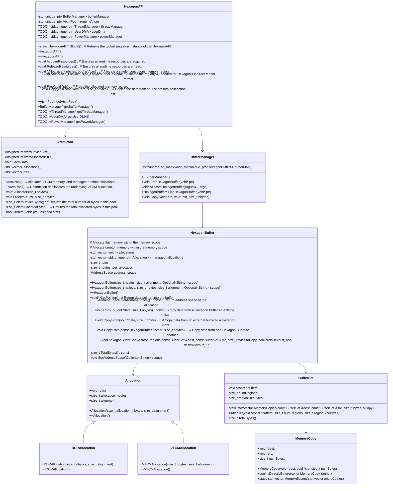
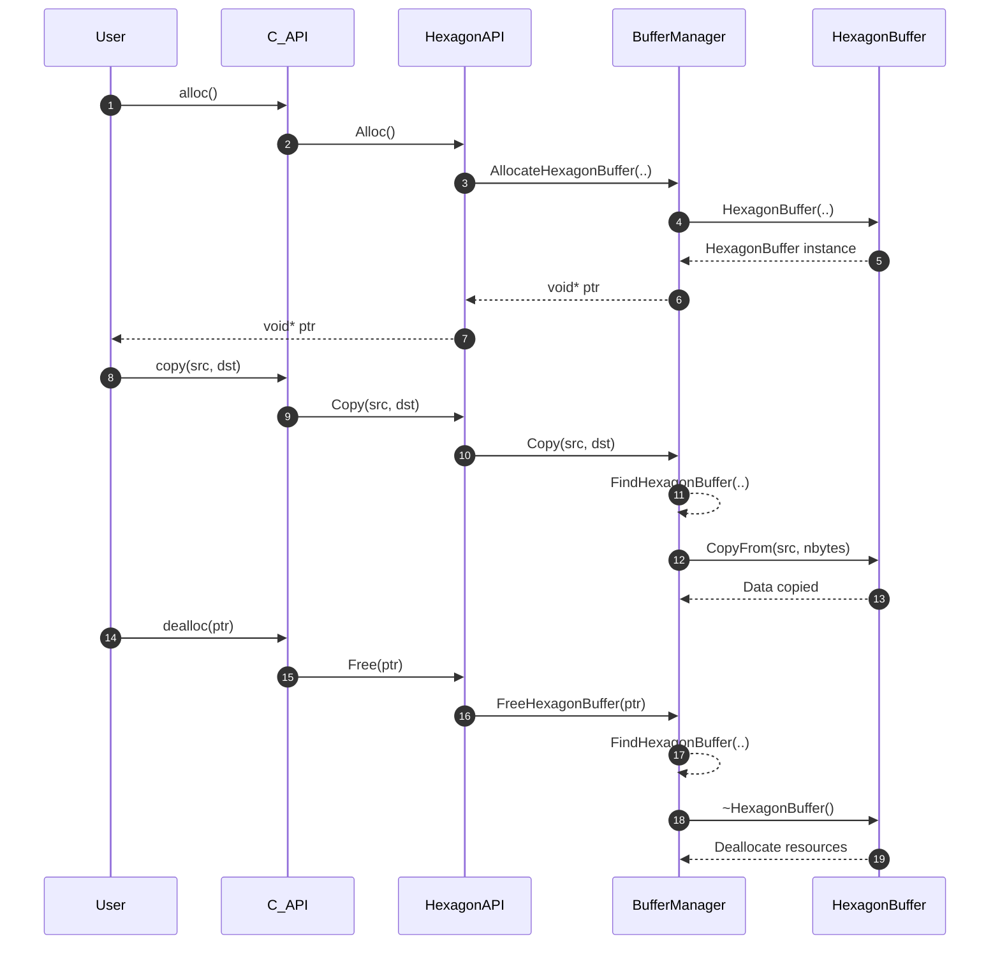
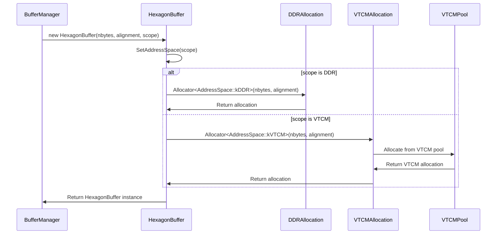

## Hexagon API runtime memory modules: Class Diagram

The diagram represents runtime memory modules for a Hexagon API, which includes several classes:

1. **HexagonAPI**:
   - Manages global resources and provides access to the `VtcmPool` and `BufferManager`.
   - Contains methods to acquire and release runtime resources.
   > TODO: HexagonAPI can have ThreadManager, UserDMA and PowerManager as well

2. **VtcmPool**:
   - Manages VTCM (Very Tightly Coupled Memory) allocations.
   - Provides methods to allocate and free VTCM memory, and track the total and allocated bytes.

3. **BufferManager**:
   - Manages Hexagon buffers, including allocation and deallocation.
   - Keeps a map of allocated buffers and provides methods to copy data between buffers.

4. **Allocation**:
   - Represents a generic memory allocation with a specified size and alignment.

5. **DDRAllocation** and **VTCMAllocation**:
   - Specialized types of `Allocation` for DDR (Double Data Rate) and VTCM memory, respectively.

6. **HexagonBuffer**:
   - Represents a buffer allocated within a specific memory scope.
   - Can handle both flat and crouton memory allocations.
   - Provides methods to get the data pointer, address space, and copy data from another buffer.

The relationships between these classes show how `HexagonAPI` interacts with `BufferManager` and `VtcmPool`, and how `BufferManager` manages `HexagonBuffer` instances. The `HexagonBuffer` class is linked to `Allocation`, which is further specialized into `DDRAllocation` and `VTCMAllocation`.

## Hexagon API runtime memory modules: Sequence Diagram

The sequence diagram illustrates the interactions between various components in the Hexagon API runtime modules during allocation, copying, and deallocation of memory buffers.

## Hexagon Buffer Allocation: Sequence Diagram

The sequence diagram outlines the process of allocating memory for a HexagonBuffer based on its address space, either DDR or VTCM.

